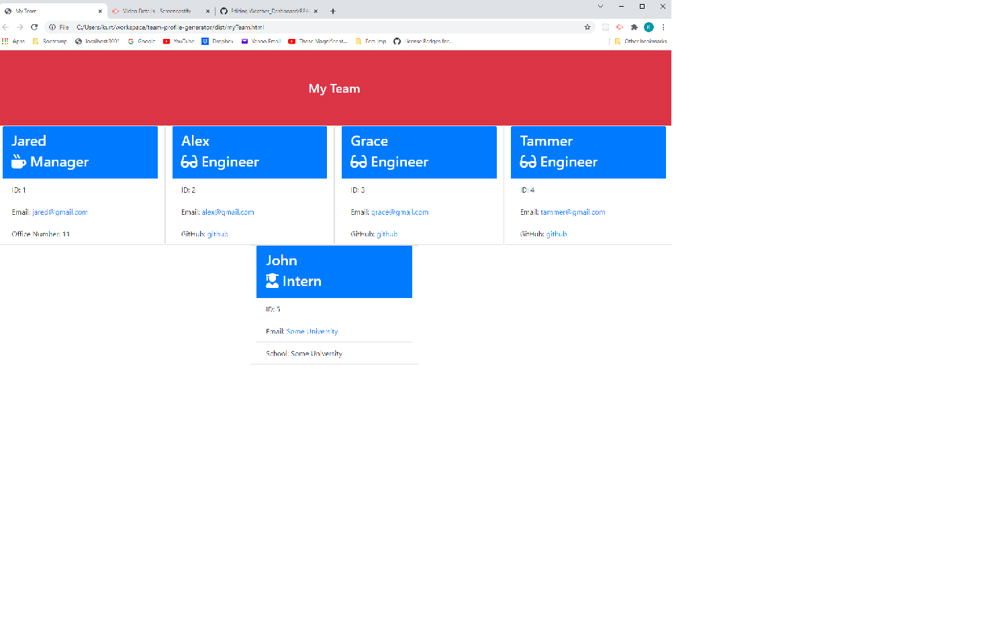

# Title: team-profile-generator

# Link to video:  https://watch.screencastify.com/v/pNT7iEZanKwaAps4cGXJ

# Description: This CLI prompts the user to enter employees.  When complete an html file is generated showing the employees.

# The resulting myTeam.html file looks like this:  

# Table of Contents:
* [Installation](#installation) 
* [Usage](#usage)
* [License](#license)
* [Contributing](#contributing)
* [Tests](#tests)
* [Reporting Issues](#issues)
* [Questions?](#questions)

## Installation - Run 'npm i' 

## Usage - Run 'node ./index.js'

## Tests - Run 'npm test'

## Contributing - Contributions can be made via this github link:  https://github.com/kurtGithubOK/team-profile-generator

## Reporting Issues - Issues can be reported via this github link:  https://github.com/kurtGithubOK/team-profile-generator

## Questions? - Questions can be emailed to the author:  email:kurtheimerman@yahoo.com
